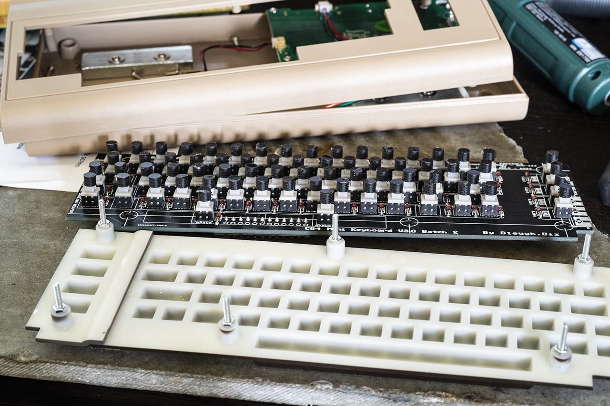
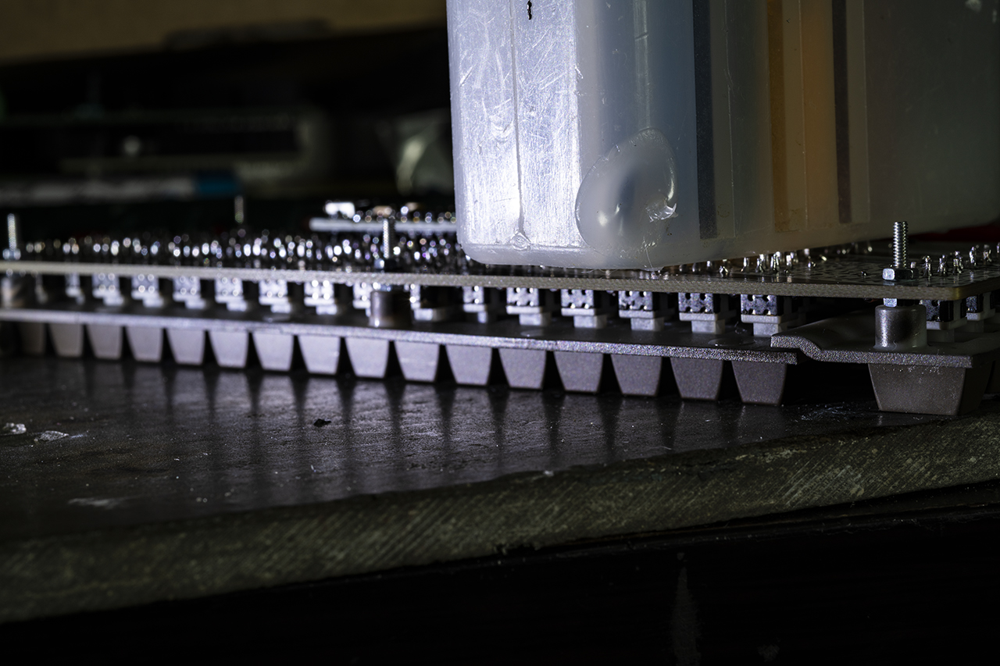
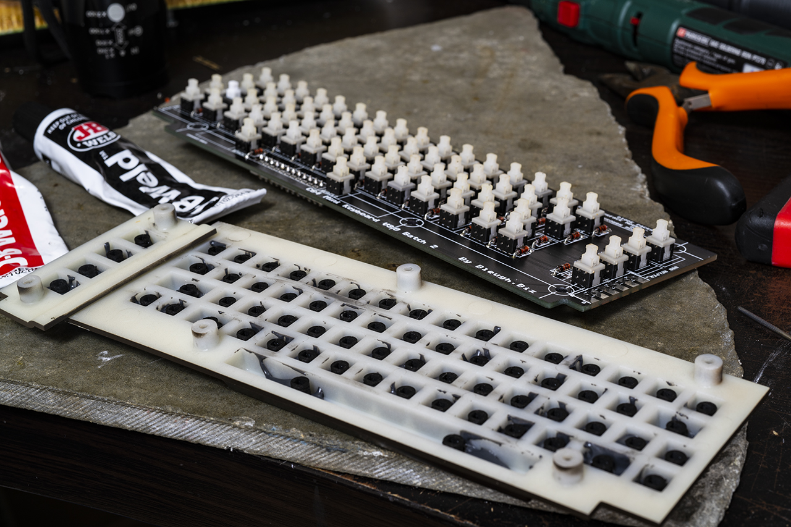
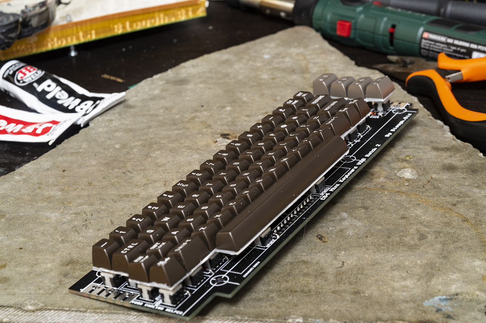

# Keycaps
The C64MiniStemCap fits on the stem of the 5.8x5.8x10mm pushbutton switch used on Dean Woolyatt's keyboard kit for the C64 Mini.
Using this cap when gluing on the keycaps achieves two things: They make the keycaps removable, and, being removable, they keycaps can be produced in a much simpler manner than the one recommended in the installation instructions. Instead of making a plaster cast of the keycap sheets and using them as a jig to glue the caps on, you can glue the sheets on as-is, remove them from the stems and separate the keycaps afterwards.





# Keymap
I use an alternate keymap for this (not included here, since it's heavily based on Dean's map), based on the one used in the The C64. It makes the keyboard 100% compatible with a real C64 keyboard.

If you make a QMK firmware for this, here's how I install it, for reference:
* Start a project in the Arduino IDE for the SparkFun Pro Micro. Don't worry about the code, the empty default project will do.
* Go to File | Preferences and make sure "Show verbose output during upload" is checked.
* Connect the keyboard the the PC, short the "Reset" pads on the keyboard and then initiate a download.
* Now you can scroll to the top in the output pane and copy the command listed there.
* Start a CMD command interface and copy the command there.
* If there are spaces in the directory path to your user directory, you need to add double quotes around all the command parts referring to those directories.
* Change the path and file name of the .hex file to be downloaded, so it refers to the QMK firmware hex file.
* Short the "reset" pads again, and then run the modified command.

Here's mine:
```
"VeryLongPath/bin/avrdude" "-CVeryLongPath/etc/avrdude.conf" -v -patmega32u4 -cavr109 -PCOM22 -b57600 -D "-Uflash:w:K:\Hans Liss\Temp\TheC64Mini\C64_TheC64Maxi.hex:i" 
```

I use a slightly modified version of the VICE keymap from the The C64 in order to achieve this (the keymap is found at _/usr/lib/vice/C64/theC64-sym-CLASSIC.vkm_).

The document **The C64 keycodes.pdf** lists the original keycodes emitted by the The C64 keyboard. The only keys that don't work for me on the The C64 Mini are the "+" and "-" keys, so I just remapped those from 0x57/0x56 to 0xC1/0xC2, which is reflected in the included copy of **theC64-sym-CLASSIC.vkm**. Copy this file to _/usr/lib/vice/C64/theC64sym-UK.vkm_ and make sure to choose the UK layout in the GUI.

# Installing the keymap
In order to copy this keymap, you will need a serial console interface. I've settled on a design where I just route the TTL level serial pins from the computer to a 3.5mm phono jack, with DCE RX at the tip, TX on the ring and GND on the sleeve. I use a USB-to-serial interface (set to 3.3v) with a fixed cable with a 3.5mm plug at the end, with TX on the tip, RX on the ring and GND on the sleeve.


Once you have a serial interface rigged like this, and the USB adapter connected to your computer, use a terminal program set to 115200 baud, 8N1, and start up the The C64 Mini. Log in as _root_ with the password _chuckpeddle_.

If you plug in a USB memory stick, you should be able to mount it using
```
mount /tmp/usbdrive/sda1 /mnt
```

Then you have to remount the root disk as read-write:
```
mount -rw -o remount /
```

Now copy the keymap:
```
cp /mnt/theC64-sym-CLASSIC.vkm /usr/lib/vice/C64/theC64sym-UK.vkm
```

Remount the root disk again, as read-only:
```
mount -r -o remount /
```

Unmount the USB stick:
```
umount /mnt
```

Shut down the system:
```
poweroff
```

... and you're good to go!

