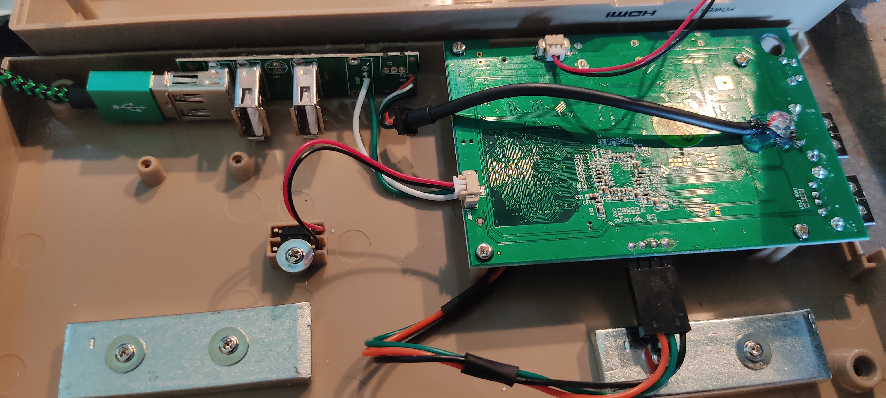
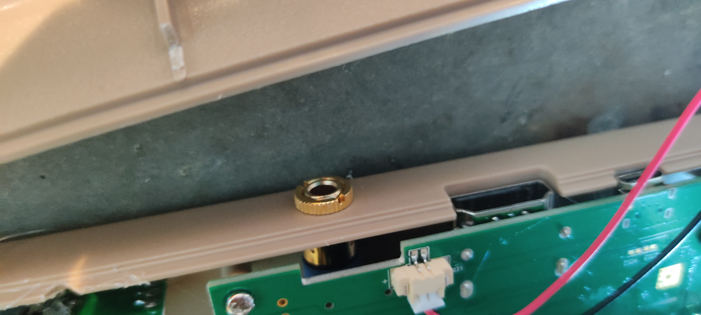
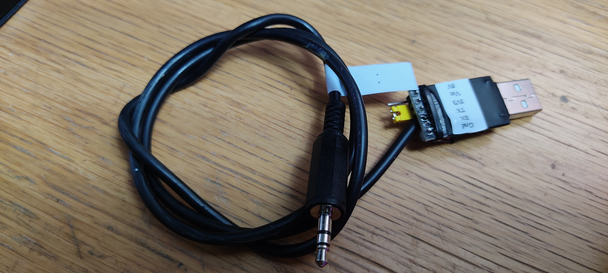

# Keycaps
The C64MiniStemCap fits on the stem of the 5.8x5.8x10mm pushbutton switch used on Dean Woolyatt's keyboard kit for the C64 Mini.
Using these caps when gluing on the keycaps achieves two things: They make the keycaps removable, and, being removable, they keycaps can be produced in a much simpler manner than the one recommended in the installation instructions. Instead of making a plaster cast of the keycap sheets and using them as a jig to glue the caps on, you can glue the sheets on as-is, remove them from the stems and separate the keycaps afterwards.

When gluing the keycaps (using very slow-hardening JB Weld epoxy glue for strength and to give me plenty of time to prepare everything) I use M2 screws with a single nut as a standoff between the PCB and the keycap sheets. _Make sure none of the pushbuttons are depressed when gluing!_


# Keymap
I use an alternate HID keymap for this, based on the one used in the The C64. It makes the keyboard 100% compatible with a real C64 keyboard. I had to deviate from the The C64 keymap on the "+" and "-" keys, unfortunately, since the original keycodes didn't work in the Mini. Note: the original QMK-based keymap I used was based on Dean's QMK code, graciously shared with me by him, but impossible for me to share with others without his explicit permission.

In order to make my keymap available in reasonably good conscience, I reverse-engineered the wiring (without looking at the existing code) using the little Arduino hack in **TheC64Mini_pintest**, and then I tried adapting my existing Arduino-based keyboard scanner, developed for the [c128kbd](https://github.com/hansliss/c128kbd) project. This worked very well, except in the actual The C64 Mini (probably something to do with how an Arduino presents itself on the USB bus), so I ended up creating my own QMK keyboard firmware from scratch instead, built with qmk 0.1.0. The keyboard subdirectory for this is in the **QMK** directory. The firmware is in **TheC64Mini_default.hex**.

If you want to load a custom firmware, here's how I install it, for reference:
* Start a project in the Arduino IDE for a SparkFun Pro Micro. Don't worry about the code, the empty default project will do.
* Go to File | Preferences and make sure "Show verbose output during upload" is checked.
* Connect the keyboard the the PC, short the "Reset" pads on the keyboard and then initiate a download.
* Now you can scroll to the top in the output pane and copy the command listed there.
* Start a CMD command interface and copy the _avrdude_ command there.
* If there are spaces in the directory path to your user directory, you need to add double quotes around all the command parts referring to those directories.
* Change the path and file name of the .hex file to be downloaded, so it refers to the QMK firmware hex file.
* Short the "reset" pads again, and then run the modified command.

Here's mine:
```
"VeryLongPath/bin/avrdude" "-CVeryLongPath/etc/avrdude.conf" -v -patmega32u4 -cavr109 -PCOM22 -b57600 -D "-Uflash:w:TheC64Mini_default.hex:i" 
```

I use a slightly modified version of the VICE keymap from the The C64 in order to achieve this (the keymap is found at _/usr/lib/vice/C64/theC64-sym-CLASSIC.vkm_).

The document **The C64 keycodes.pdf** lists the original keycodes emitted by the The C64 keyboard. The only keys that don't work for me on the The C64 Mini are the "+" and "-" keys, so I just remapped those from 0x57/0x56 to 0xC1/0xC2, which is reflected in the included copy of **theC64-sym-CLASSIC.vkm**. Copy this file to _/usr/lib/vice/C64/theC64sym-UK.vkm_ and make sure to choose the UK layout in the GUI.

# Installing the keymap
In order to copy the VICE keymap, you can either use a serial console interface on your The C64 Mini (see below) or use jj0's [On-screen Command Line](https://thec64community.online/thread/806/the64-on-screen-command-line)

If you use the on-screen command line, add the keymap to your USB stick before starting the shell. Then, with the shell open, you need to make the root disk writable, back up the original keymap, and then copy the new one to the root disk. Then you make the root disk read-only again:
```
mount -rw -o remount /
mv /usr/lib/vice/C64/theC64-sym-UK.vkm /usr/lib/vice/C64/theC64-sym-UK.save
cp /mnt/theC64-sym-CLASSIC.vkm /usr/lib/vice/C64/theC64sym-UK.vkm
mount -r -o remount /
```

Then exit the shell with ```exit```.

Here's how to add a serial interface which is both useful and lots of fun to have. I've settled on a design where I just route the TTL level serial pins from the computer to a 3.5mm phono jack, with DCE RX at the tip, TX on the ring and GND on the sleeve. I use a USB-to-serial interface (set to 3.3v) with a fixed cable with a 3.5mm plug at the end, with TX on the tip, RX on the ring and GND on the sleeve.





Once you have a serial interface rigged like this, and the USB adapter connected to your computer, use a terminal program set to 115200 baud, 8N1, and start up the The C64 Mini. Log in as _root_ with the password _chuckpeddle_.

If you plug in a USB memory stick, you should be able to mount it using
```
mount /tmp/usbdrive/sda1 /mnt
```

Then you have to remount the root disk as read-write:
```
mount -rw -o remount /
```

Now copy the keymap:
```
cp /mnt/theC64-sym-CLASSIC.vkm /usr/lib/vice/C64/theC64sym-UK.vkm
```

Remount the root disk again, as read-only:
```
mount -r -o remount /
```

Unmount the USB stick:
```
umount /mnt
```

Shut down the system:
```
poweroff
```

... and you're good to go!

